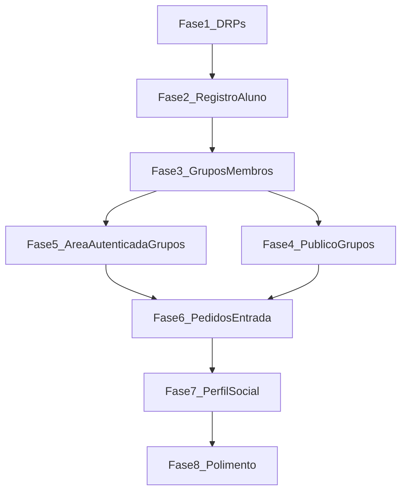

# Roadmap de implementação (pigpig)

Este arquivo organiza o trabalho em **fases sequenciais**, alinhadas à [arquitetura.md](./arquitetura.md). Cada fase deve ser concluída e **testada** antes de iniciar a próxima.

**Regra:** não começar a fase **N+1** até os testes da fase **N** estarem passando (ou, na fase 1, até o critério de pronto estar atendido).

**Comandos úteis (durante a implementação):**

- Testes de um arquivo: `php artisan test --compact tests/Feature/SeuTeste.php`
- Testes com filtro: `php artisan test --compact --filter=nomeDoTeste`

---

## Fase 1 — DRPs como dado de sistema

**Objetivo:** Disponibilizar DRPs e **polos UNIVESP** no banco (dados versionados), para seleção no cadastro e para agrupar grupos, **sem tela de administrador**. A lista oficial de polos e o mapeamento polo → código DRP vêm do CSV [`database/seeders/polos_drp.csv`](database/seeders/polos_drp.csv); os códigos DRP únicos no arquivo (ex.: `DRP01` … `DRP14`) são a fonte das linhas em `drps`, com `slug` normalizado em minúsculas (`drp01`, …).

### Checklist

- [x] Migração `drps` (`name`, `slug` opcional, `timestamps`; **soft deletes** na implementação atual).
- [x] Model `Drp` + factory + relação `polos()`.
- [x] Migração `polos` (`drp_id` FK para `drps`, `name`, unicidade composta `drp_id` + `name`).
- [x] Model `Polo` + factory.
- [x] Leitor [`database/seeders/Support/PolosDrpCsvReader.php`](database/seeders/Support/PolosDrpCsvReader.php) (cabeçalho `Polo,DRP`).
- [x] `DrpSeeder` (idempotente, derivado dos códigos DRP distintos do CSV) e `PoloSeeder` (idempotente por DRP + nome do polo), registrados em [`DatabaseSeeder`](database/seeders/DatabaseSeeder.php) **nessa ordem**.
- [x] CSV versionado no repositório; em **produção**, o arquivo deve ir no deploy para `php artisan db:seed` funcionar.

### Testes sugeridos

- [x] Feature: [`tests/Feature/DrpSeederTest.php`](tests/Feature/DrpSeederTest.php) e [`tests/Feature/PoloSeederTest.php`](tests/Feature/PoloSeederTest.php) (contagens esperadas e idempotência do seed).

### Definição de pronto

- Tabelas `drps` e `polos` migráveis; modelos utilizáveis no código; dados iniciais reproduzíveis via seeders em dev, teste e produção (com CSV presente no artefato).

---

## Fase 2 — Cadastro de aluno com DRP e telefone

**Objetivo:** Registro com nome, e-mail, telefone, senha e **DRP** escolhida, conforme regra de negócio. **Nota:** o vínculo do aluno é à **DRP** (`drp_id`); **polo não é obrigatório** no cadastro nesta fase (polos já existem no banco para uso futuro, p. ex. relatórios ou campo opcional).

### Checklist

- [x] Migração em `users`: `phone` (ou `telephone`) e `drp_id` (FK para `drps`, `restrict`/`cascade` conforme política).
- [x] Atualizar modelo `User` (`$fillable` / casts se necessário) e relação `belongsTo(Drp::class)`.
- [x] Ajustar `CreateNewUser` e regras de validação (ex.: `ProfileValidationRules` / request dedicado).
- [x] Formulário de registro Inertia: campo telefone + select de DRP (lista vinda do backend).
- [ ] (Opcional) Ajustar fluxo de verificação de e-mail se já estiver ativo no Fortify.

### Testes sugeridos

- [x] Registro com DRP válido persiste `drp_id` e `phone`.
- [x] Registro falha sem DRP, com DRP inexistente ou telefone inválido (regras que vocês adotarem).

### Definição de pronto

- Novo aluno nasce sempre vinculado a uma DRP válida; telefone obrigatório no cadastro.

---

## Fase 3 — Grupos e membros (schema + regras básicas)

**Objetivo:** Modelar grupo de PI por DRP e quem é responsável / membro, ainda sem fluxo completo de pedidos (isso é a fase 6).

### Checklist

- [ ] Migração `groups`: `drp_id`, identificação/tema (ex.: `title` ou `topic`), `creator_id` (responsável inicial), `external_communication_link` nullable (pode ficar só no schema até a fase 8 se preferir).
- [ ] Membros: tabela pivot `group_user` (ou equivalente) com papel se necessário (`owner`/`member`) **ou** `creator_id` + pivot só para membros — documentar a escolha no código.
- [ ] Garantir que o criador seja membro e/ou responsável de forma consistente (observer, action de criação ou service).
- [ ] Models `Group`, relações com `Drp`, `User`, factories para testes.

### Testes sugeridos

- [ ] Criar grupo válido: `drp_id` e `creator_id` coerentes.
- [ ] Grupo não pode “mudar de DRP” de forma inconsistente com membros (se a regra for fixa por grupo).
- [ ] Criador refletido como responsável para políticas futuras.

### Definição de pronto

- É possível persistir grupos e membros no banco com integridade; factories permitem testes das fases seguintes.

---

## Fase 4 — Descoberta pública (sem conta)

**Objetivo:** Visitante anônimo lista grupos e vê membros, somente leitura ([arquitetura §3.4](./arquitetura.md)).

### Checklist

- [ ] Rotas públicas (sem `auth`): índice de grupos (todos, com filtro por DRP opcional na mesma fase ou como sub-item).
- [ ] Rota pública de detalhe do grupo com lista de membros.
- [ ] Páginas Inertia: dados mínimos acordados (nome do grupo, tema, DRP, nomes dos membros na listagem pública — **não** expor e-mail/telefone na área pública salvo decisão explícita).
- [ ] Garantir que rotas de mutação (criar grupo, pedidos, perfil) permaneçam protegidas.

### Testes sugeridos

- [ ] `Guest` acessa `200` na listagem e no show.
- [ ] `Guest` não consegue POST/PUT/PATCH/DELETE em ações de grupo/membro.

### Definição de pronto

- Fluxo de leitura pública estável e coberto por testes; superfície de dados pública alinhada à LGPD em alto nível.

---

## Fase 5 — Área autenticada: contexto da DRP do aluno

**Objetivo:** Após login, o aluno opera na **própria DRP**: ver grupos relevantes e **criar** grupo apenas nessa DRP.

### Checklist

- [ ] Página(s) autenticada(s): listagem de grupos da DRP do usuário (e/ou “meus grupos”).
- [ ] Ação criar grupo: validar que `drp_id` do grupo = `drp_id` do usuário autenticado.
- [ ] `Policy` / autorização: criar grupo só autenticado; opcionalmente “editar grupo” só responsável (preparar fase 6).
- [ ] Navegação Wayfinder/Inertia conforme convenções do projeto.

### Testes sugeridos

- [ ] Usuário da DRP A cria grupo com sucesso em A.
- [ ] Tentativa de criar grupo na DRP B falha (403/422 conforme desenho da API/UI).

### Definição de pronto

- Criação de grupo pelo aluno respeita o vínculo DRP do cadastro; listagens autenticadas coerentes.

---

## Fase 6 — Pedidos de entrada (core social)

**Objetivo:** Solicitar entrada, responsável **aceita** ou **recusa**; ao aceitar, vira membro respeitando **limite de vagas** ([arquitetura §3.5](./arquitetura.md)).

### Checklist

- [ ] Migração `group_join_requests` (nome pode variar): `group_id`, `user_id`, `status` (`pending`, `accepted`, `declined`), timestamps; índice/unique para evitar múltiplos `pending` duplicados se for regra.
- [ ] Endpoints ou ações Inertia: `store` pedido, `accept`/`decline` só para responsável do grupo.
- [ ] Service opcional para transições (validar DRP do solicitante = DRP do grupo, vagas, estado do pedido).
- [ ] UI: botões/listas de pedidos pendentes para o responsável.

### Testes sugeridos

- [ ] Fluxo feliz: pedido → aceite → membro adicionado.
- [ ] Recusa não adiciona membro.
- [ ] Grupo cheio: aceite impossível ou erro claro.
- [ ] Solicitante de outra DRP não consegue pedido (ou pedido inválido).
- [ ] Pedido duplicado pendente tratado.

### Definição de pronto

- Ciclo pedido → aceite/recusa está completo e testado; regras de vagas e DRP aplicadas no backend.

---

## Fase 7 — Perfil opcional (redes sociais)

**Objetivo:** Campos não obrigatórios (Instagram, LinkedIn, X/Twitter, etc.) e edição pelo próprio aluno.

### Checklist

- [ ] Migração: colunas nullable (ex.: `instagram_url`, `linkedin_url`, `twitter_url`) ou estrutura equivalente validada.
- [ ] Estender fluxo de perfil existente (Fortify / settings Inertia) com os novos campos.
- [ ] Decidir o que aparece na área pública vs só autenticado; ajustar serializers/props das páginas públicas se necessário.

### Testes sugeridos

- [ ] Atualizar perfil com URLs válidas; campos vazios permitidos.
- [ ] Validação de formato URL (se aplicável).

### Definição de pronto

- Aluno pode enriquecer o perfil sem quebrar cadastro mínimo; testes cobrem happy path e validação.

---

## Fase 8 — Polimento e não-funcionais

**Objetivo:** Fechar UX e regras globais (limites, link externo, performance opcional).

### Checklist

- [ ] UI para `external_communication_link` (se ainda não estiver completa).
- [ ] Constante ou `config` para mínimo/máximo de integrantes (ex.: 5–7); mensagens de erro amigáveis.
- [ ] (Opcional) Cache para listagens públicas (`remember`, Redis, etc.).
- [ ] Documentar em um parágrafo (README ou comentário de política) o que é dado público vs restrito (LGPD).

### Testes sugeridos

- [ ] Limite máximo respeitado ao aceitar pedidos / adicionar membros.
- [ ] (Se cache) teste de regressão ou feature que garanta invalidação ou TTL aceitável.

### Definição de pronto

- Regras de tamanho do grupo e link externo consistentes com o produto; melhorias opcionais de performance documentadas.

---

## Diagrama de dependências entre fases

Ordem linear recomendada após a fase 3: **4 → 5 → 6** (público primeiro valida leitura; depois mutações autenticadas; por fim pedidos, que dependem de ambos).
