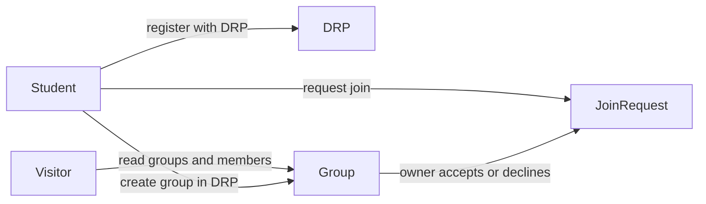

# Arquitetura de Software: Sistema de Formação de Grupos de Projeto Integrador por DRP Univesp

## 1. Visão Geral da Arquitetura

O sistema será desenvolvido com arquitetura **fullstack** baseada no modelo cliente-servidor: o framework **Laravel** no backend (lógica de negócio, persistência, segurança e renderização de páginas) e **React** no frontend, integrados por **Inertia.js**, de modo que cada tela é uma página React servida pelo Laravel sem a complexidade de uma SPA totalmente desacoplada.

A separação de responsabilidades permanece clara (camadas de apresentação, aplicação e persistência), facilitando manutenção, testes e evolução. A navegação ocorre via **Inertia** (visitas que retornam componentes React com dados em formato JSON nas props). Endpoints ou respostas JSON adicionais podem existir pontualmente quando fizer sentido (por exemplo, integrações futuras), mas **não** são o eixo principal da arquitetura.

O núcleo do negócio é a **organização de grupos por DRP**, com **pedidos de entrada** e **aceite ou recusa** pelo responsável pelo grupo — não um algoritmo obrigatório de alocação automática de alunos.

## 2. Componentes Principais

A solução é dividida em três camadas lógicas principais:

### 2.1. Camada de Apresentação (Frontend - React + Inertia)

A camada de apresentação atende **alunos autenticados** e **visitantes anônimos** (área pública de descoberta de grupos). As interfaces são construídas com **React**, empacotadas com **Vite**, com estilização **Tailwind CSS** e componentes reutilizáveis alinhados ao que o projeto já adota.

- **Navegação:** Inertia gerencia as transições entre páginas sem recarregar a aplicação como um site tradicional multipágina, mantendo a experiência fluida.
- **Estado:** Dados de servidor chegam principalmente via **props** das páginas Inertia; estado de interface e formulários usa estado local de componentes (e hooks do Inertia quando aplicável), sem impor bibliotecas de estado global que não façam parte do stack acordado.
- **Integração com o backend:** Formulários e ações enviam requisições ao Laravel (Inertia visits, `router`, ou requisições HTTP pontuais quando necessário), com proteção **CSRF** nos fluxos web típicos do Laravel.

### 2.2. Camada de Aplicação e Negócios (Backend - Laravel)

O backend em Laravel é o núcleo do sistema: regras de negócio, validação, autenticação e autorização.

- **Roteamento e controladores:** Requisições HTTP são direcionadas a rotas e controladores (ou ações equivalentes), mantendo a orquestração enxuta.
- **Autenticação:** **Laravel Fortify** (e fluxo de sessão/cookies adequado ao Inertia) para registro, login e rotinas de autenticação do produto.
- **Autorização:** Não há múltiplos *papéis* de produto (como orientador ou administrador). A autorização concentra-se em regras do tipo: **próprio aluno**, **criador/responsável pelo grupo**, **membro do grupo** — conforme cada funcionalidade for implementada.
- **Serviços (Services):** Regras mais complexas — por exemplo, **pedidos de entrada**, **limites de vagas**, **garantia de que grupo e membros pertencem à mesma DRP**, **transições de estado dos pedidos** — podem ficar em classes de serviço dedicadas, mantendo controladores enxutos.
- **Validação:** Toda entrada deve ser validada antes de persistência ou efeitos colaterais relevantes.

### 2.3. Camada de Persistência (Banco de Dados)

- **SGBD:** Banco relacional (ex.: **PostgreSQL**), adequado às relações entre alunos, DRPs, grupos, membros e pedidos de participação.
- **ORM (Eloquent):** Interação orientada a objetos com o banco, com **migrações** versionando o esquema.
- **Modelo conceitual (alto nível):** vínculo **Aluno (usuário) ↔ DRP**; **Grupo ↔ DRP**; membros do grupo; **pedidos de participação** com estados como pendente, aceito e recusado.

## 3. Regras de Negócio e Fluxos Principais

### 3.1. Estrutura Organizacional

- **DRP (Diretoria Regional Pedagógica):** Eixo principal do produto. Os **grupos** são criados e listados **por DRP**; o aluno **declara a DRP à qual pertence** no cadastro (não há, neste desenho, derivação automática da DRP a partir de outro vínculo obrigatório).
- **Grupo de PI:** Reúne alunos para o projeto integrador. Integrantes devem pertencer à **mesma DRP** do grupo.
- **Polo (contexto institucional):** Na organização da UNIVESP, polos regionais podem existir sob DRPs. Neste produto, **o cadastro não exige polo** nem usa polo para determinar DRP; se no futuro campos opcionais ou relatórios institucionais precisarem de polo, isso pode ser evoluído sem mudar o requisito atual de **DRP explícita no registro**.

### 3.2. Fluxo de Cadastro e Autenticação

1. **Cadastro obrigatório:** nome, e-mail, telefone, senha e **DRP à qual o aluno pertence** (seleção ou associação clara no formulário).
2. **Login:** e-mail (ou identificador acordado) e senha, conforme implementação com Fortify.
3. **Verificação de e-mail:** pode ser exigida conforme configuração do projeto (ex.: Fortify + `verified`), alinhada às políticas de segurança.

### 3.3. Perfil do Aluno (Opcional)

Além dos dados obrigatórios do cadastro, o aluno pode **opcionalmente** enriquecer o perfil com links ou identificadores de redes sociais (ex.: Instagram, LinkedIn, X/Twitter), sempre respeitando **LGPD** e políticas de visibilidade (o que aparece na área pública versus apenas para membros logados deve ser definido na implementação).

### 3.4. Descoberta Pública (Sem Conta)

**Visitantes sem conta** podem **listar os grupos** que estão sendo organizados e **consultar quais são os membros** (no escopo definido pelo produto: por exemplo, todas as DRPs com filtro por DRP). Isso implica **rotas e páginas públicas** somente leitura, com cuidado para expor apenas dados acordados (nomes, tema do grupo, DRP, etc.).

### 3.5. Fluxo de Formação de Grupos (Core Business)

Processo central: conectar alunos da mesma DRP por meio de grupos e pedidos explícitos.

1. **Contexto do aluno autenticado:** Após login, o aluno interage no contexto da **sua DRP** (listagens e criação de grupo alinhadas a essa DRP).
2. **Visualização de grupos (autenticado):** O aluno pode ver grupos da sua DRP com vagas disponíveis, respeitando limites de integrantes (ex.: 5 a 7, conforme diretrizes da Univesp), se esses limites forem regra do produto.
3. **Criar grupo:** O aluno cria um novo grupo (ex.: tema ou área preliminar) e torna-se o **responsável** inicial (criador/líder para fins de aprovação de pedidos).
4. **Pedir para entrar:** Outro aluno (mesma DRP, quando aplicável) solicita entrada em um grupo existente.
5. **Aceitar ou recusar:** O responsável pelo grupo **aceita** ou **recusa** cada pedido; apenas pedidos aceitos integram o aluno como membro, respeitando vagas e regras de DRP.
6. **Comunicação externa (opcional):** O grupo pode disponibilizar um link para canal externo (ex.: WhatsApp, Telegram), após critérios definidos (mínimo de membros, finalização do cadastro do grupo no sistema, etc.).

### 3.6. Cadastro de DRPs e Parâmetros do Sistema

Não há **usuários administradores ou orientadores** no produto. O cadastro de **DRPs** (e parâmetros globais como tamanho máximo do grupo, se não forem apenas constantes no código) pode ser tratado como **dados iniciais via migrações, seeders ou configuração de ambiente**, fora do escopo de telas de “admin” para papéis distintos de aluno.

## 4. Visão do Fluxo (Resumo)

## 5. Considerações de Segurança e Escalabilidade

- **Segurança em camadas:** **Leitura pública** apenas nas rotas/páginas explicitamente públicas (listagem de grupos e membros), expondo o mínimo necessário. **Mutações** (criar grupo, pedir entrada, aceitar/recusar, editar perfil, alterar senha) exigem **autenticação** (e autorização por dono/membro onde couber). Dados sensíveis e tratamento de titulares seguem a **LGPD**. O Laravel oferece proteções nativas relevantes (incluindo **CSRF** em formulários web, mitigação de **SQL injection** via query builder/ORM, boas práticas contra **XSS** no front).
- **Escalabilidade:** A stack Laravel + assets front-end via Vite permite evoluir deploy e cache de forma independente. **Cache** (ex.: Redis) pode acelerar listagens públicas frequentes (grupos, DRPs) e outras consultas repetidas.

