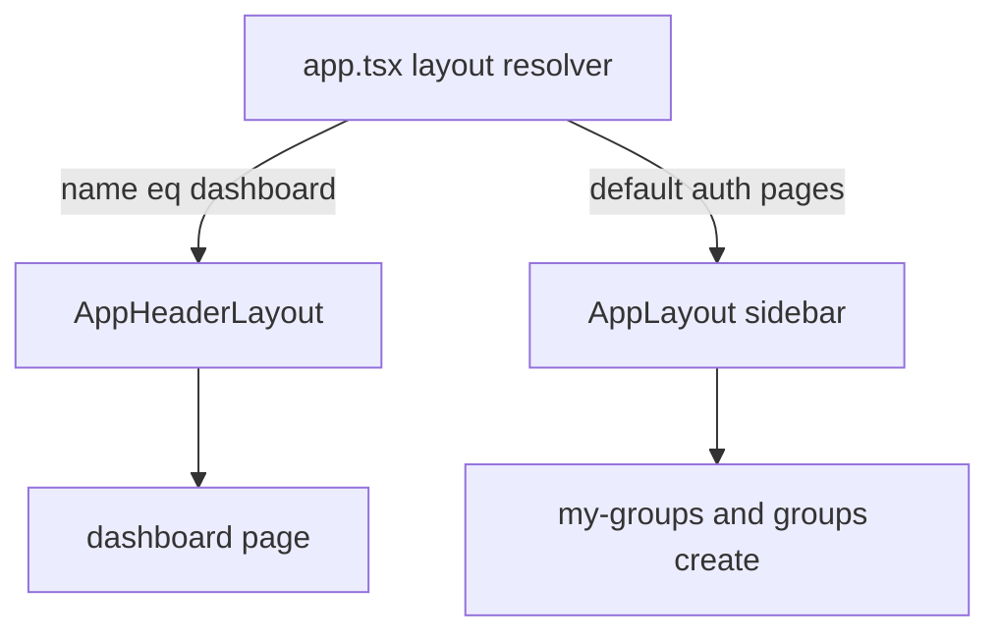

# UI da área autenticada: `/dashboard` sem sidebar

Este documento descreve **em fases** o que alterar para que a rota `/dashboard` deixe de usar o shell estilo “dashboard” com **sidebar lateral**, alinhando a experiência ao núcleo do produto (criar e participar de grupos). Os caminhos de ficheiros e identificadores de código mantêm-se em **inglês**, como no repositório.

**Decisão da Fase 0 (preencher antes de implementar):**

- [ ] **Opção A** — Manter `/dashboard` como página de início **sem sidebar** (hub simples + `AppHeaderLayout`).
- [ ] **Opção B** — Redirecionar o pós-login para outra rota (ex.: `/my/groups`) e eventualmente remover ou aliasar `dashboard`.

---

## Contexto técnico

- **Rota:** [`routes/web.php`](../routes/web.php) — `Route::inertia('dashboard', 'dashboard')->name('dashboard')` dentro de middleware `auth` e `verified`.
- **Pós-login:** [`config/fortify.php`](../config/fortify.php) — `'home' => '/dashboard'`.
- **Layout atual (sidebar):** Em [`resources/js/app.tsx`](../resources/js/app.tsx), o resolver de `layout` isenta apenas `welcome` e `groups/index` | `groups/show`. O caso **default** usa [`AppLayout`](../resources/js/layouts/app-layout.tsx), que embute [`app-sidebar-layout.tsx`](../resources/js/layouts/app/app-sidebar-layout.tsx) (`AppSidebar`, `AppSidebarHeader`, breadcrumbs).
- **Layout alternativo (já existe):** [`app-header-layout.tsx`](../resources/js/layouts/app/app-header-layout.tsx) — `AppShell variant="header"`, [`AppHeader`](../resources/js/components/app-header.tsx), `AppContent variant="header"` (barra superior, **sem** sidebar fixa). **Não** é selecionado hoje pelo resolver global.
- **Página:** [`resources/js/pages/dashboard.tsx`](../resources/js/pages/dashboard.tsx) — conteúdo placeholder; `Dashboard.layout.breadcrumbs` apontam para “Dashboard”.
- **Navegação assimétrica:** [`app-sidebar.tsx`](../resources/js/components/app-sidebar.tsx) lista Dashboard, Meus grupos, Criar grupo; [`app-header.tsx`](../resources/js/components/app-header.tsx) só inclui **Dashboard** em `mainNavItems`. Quem implementar a Opção A deve **alinhar** a navegação do header às ações reais do produto.

### Fluxo de layouts (visão)

---

## Fase 0 — Decisão de produto (obrigatória antes de codar)

Escolher **uma** estratégia e registar acima marcando a opção.

### Opção A — Manter `/dashboard` como início sem sidebar

- **Prós:** URL e `Fortify::home` estáveis; uma página de **entrada** explícita com CTAs (Meus grupos, Criar grupo, eventualmente descoberta pública).
- **Contras:** Mais uma página para manter; copy e i18n precisam refletir “início” em vez de “painel genérico”.

### Opção B — Eliminar hub e redirecionar

- **Prós:** Menos superfície de UI; o utilizador cai direto na lista de grupos da DRP.
- **Contras:** Alterar `Fortify::home`, links “Painel” na landing/shell público, testes e possivelmente `route('dashboard')` em todo o código; pode ser necessário alias ou redirect 301/302 de `/dashboard` para não partir bookmarks.

**Nota:** As fases seguintes assumem **Opção A**. Se escolher **Opção B**, substituir as fases 1–3 por: definir rota alvo, redirect ou remoção de `dashboard`, atualizar Fortify/links/testes, e ignorar `AppHeaderLayout` só para `dashboard` (a menos que a rota deixe de existir).

---

## Fase 1 — Resolver de layout Inertia (`app.tsx`)

**Objetivo:** A página `dashboard` usar `AppHeaderLayout` em vez de `AppLayout`.

**Checklist:**

- [ ] Importar o default export de [`resources/js/layouts/app/app-header-layout.tsx`](../resources/js/layouts/app/app-header-layout.tsx) em [`resources/js/app.tsx`](../resources/js/app.tsx) (ou reexport via um barrel, se o projeto adotar esse padrão).
- [ ] No `createInertiaApp({ layout: (name) => { ... } })`, tratar `name === 'dashboard'` e devolver **`AppHeaderLayout`**.
- [ ] Manter `name.startsWith('settings/')` com `[AppLayout, SettingsLayout]`.
- [ ] Manter páginas como `my-groups/index`, `groups/create`, etc. no **default** `AppLayout` (sidebar), salvo decisão explícita de simplificar toda a área autenticada.

---

## Fase 2 — Paridade do shell “header” com o “sidebar”

**Objetivo:** Não regressar UX ao trocar de `app-sidebar-layout` para `app-header-layout` na rota inicial.

**Checklist:**

- [ ] Incluir [`EmailVerificationBanner`](../resources/js/components/email-verification-banner.tsx) com `variant="app"` em [`app-header-layout.tsx`](../resources/js/layouts/app/app-header-layout.tsx) (por exemplo acima do conteúdo principal, espelhando [`app-sidebar-layout.tsx`](../resources/js/layouts/app/app-sidebar-layout.tsx)).
- [ ] Alinhar `mainNavItems` em [`app-header.tsx`](../resources/js/components/app-header.tsx) com os links essenciais já presentes em [`app-sidebar.tsx`](../resources/js/components/app-sidebar.tsx) (ex.: Meus grupos, Criar grupo).
- [ ] Decidir nomenclatura do primeiro item: manter “Dashboard / Painel” ou renomear para “Início / Home” e atualizar chaves i18n na Fase 4.

---

## Fase 3 — Página `dashboard.tsx` (conteúdo e cópia)

**Objetivo:** Substituir placeholders por um **hub** coerente com [`arquitetura.md`](../arquitetura.md) (fluxo de grupos, DRP).

**Checklist:**

- [ ] Remover `PlaceholderPattern` e grelha decorativa sem função.
- [ ] Implementar conteúdo mínimo: atalhos para `my-groups`, `groups/create`, e opcionalmente descoberta pública (`groups/index`) se fizer sentido no produto.
- [ ] Reavaliar `Dashboard.layout.breadcrumbs`: com um único nível, o [`AppHeader`](../resources/js/components/app-header.tsx) só mostra breadcrumbs se `length > 1`; ajustar ou remover breadcrumbs redundantes.

---

## Fase 4 — Navegação e i18n

**Checklist:**

- [ ] Rever chaves em ficheiros de tradução (`app.dashboard.*`, `app.shell.nav.*`, `app.shell.breadcrumb.dashboard`) conforme o novo papel da página.
- [ ] Se a rota ou o rótulo mudarem: atualizar [`landing-nav.tsx`](../resources/js/components/landing/landing-nav.tsx), [`groups-public-shell.tsx`](../resources/js/components/groups-public-shell.tsx), e breadcrumbs em [`my-groups/index.tsx`](../resources/js/pages/my-groups/index.tsx) e [`groups/create.tsx`](../resources/js/pages/groups/create.tsx).

---

## Fase 5 — Backend e Wayfinder

**Checklist:**

- [ ] Se a URL de “home” mudar: atualizar [`config/fortify.php`](../config/fortify.php) e todas as referências `route('dashboard')` em PHP.
- [ ] Se rotas forem renomeadas ou adicionadas: `php artisan wayfinder:generate` e corrigir imports em `@/routes` / `@/actions` no frontend.

---

## Fase 6 — Testes

**Checklist:**

- [ ] [`tests/Feature/DashboardTest.php`](../tests/Feature/DashboardTest.php) — garantir que utilizadores autenticados continuam a aceder; acrescentar asserts se o projeto passar a testar componente ou props relevantes.
- [ ] Testes de auth com redirect para `route('dashboard')`: [`AuthenticationTest.php`](../tests/Feature/Auth/AuthenticationTest.php), [`RegistrationTest.php`](../tests/Feature/Auth/RegistrationTest.php), [`EmailVerificationTest.php`](../tests/Feature/Auth/EmailVerificationTest.php), [`VerificationNotificationTest.php`](../tests/Feature/Auth/VerificationNotificationTest.php).
- [ ] Testes de tradução: [`GroupsAppTranslationPropsTest.php`](../tests/Feature/GroupsAppTranslationPropsTest.php), [`AppShellTranslationPropsTest.php`](../tests/Feature/AppShellTranslationPropsTest.php).
- [ ] [`tests/Browser/LoginTest.php`](../tests/Browser/LoginTest.php) — path esperado após login se mudar na Opção B.

---

## Fase 7 — Atualização da arquitetura

**Checklist:**

- [ ] Acrescentar em [`arquitetura.md`](../arquitetura.md) (por exemplo na secção 2.1, Camada de Apresentação) uma frase curta sobre o **shell** da primeira página após login: **sem sidebar** na rota `/dashboard` (Opção A), ou **redirect** para `/my/groups` (Opção B), para o documento refletir a UX real.

---

## Referência rápida de ficheiros

| Área | Ficheiros |
|------|-----------|
| Rota | `routes/web.php` |
| Pós-login | `config/fortify.php` |
| Resolver layout | `resources/js/app.tsx` |
| Layouts | `resources/js/layouts/app-layout.tsx`, `resources/js/layouts/app/app-sidebar-layout.tsx`, `resources/js/layouts/app/app-header-layout.tsx` |
| Navegação | `resources/js/components/app-sidebar.tsx`, `resources/js/components/app-header.tsx` |
| Página | `resources/js/pages/dashboard.tsx` |
| Arquitetura de negócio | `arquitetura.md` |
