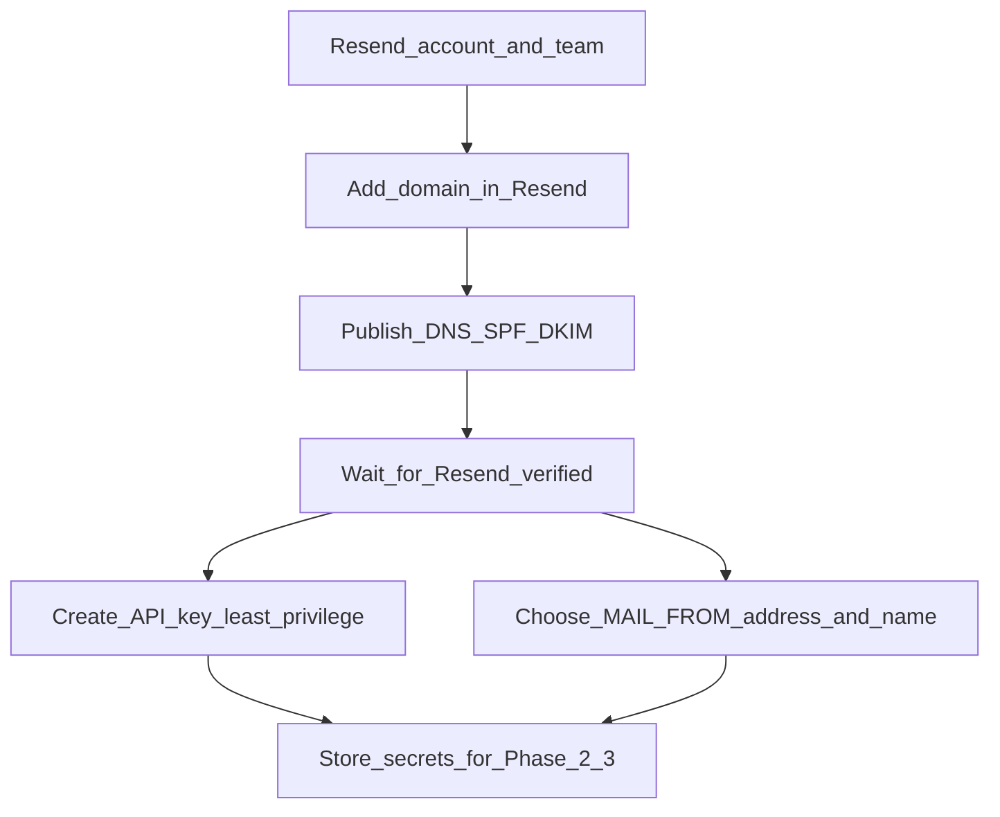
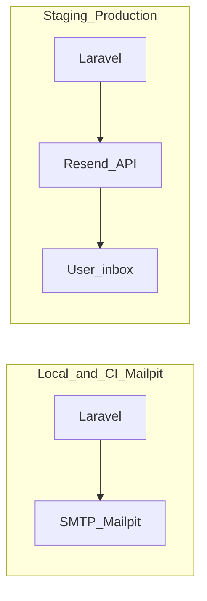

# Email provider migration: Resend

This document describes how Pigpig uses email today and how to use **Resend** in staging/production while keeping **Mailpit** for local development and integration tests.

**Official guide (Laravel):** [Send emails with Laravel (Resend)](https://resend.com/docs/send-with-laravel.md)

---

## Environment matrix

| Environment        | Mailer              | Purpose |
|--------------------|---------------------|---------|
| Local / Docker     | `smtp` → Mailpit    | Capture mail in the UI without calling external APIs. |
| PHPUnit (default)  | Fakes / `log` / etc. | Feature tests use `Notification::fake()`; no real delivery. |
| Mailpit integration tests | `smtp` → Mailpit | Run with `RUN_MAILPIT_TESTS=1` and Mailpit running (`composer run test:mailpit`). |
| Staging / production | `resend`          | Deliver via Resend API; requires `resend/resend-php` and `RESEND_API_KEY`. |

---

## Phase 0 — Prerequisites (Resend account)

Phase 0 is **operational only** (Resend dashboard and DNS). No application code changes are required to complete it.

### Recommended order



- **Domain is the critical path:** Without a verified domain, `MAIL_MAILER=resend` will reject or fail sends. DNS propagation can take minutes to hours.
- **API key:** You can create it while DNS propagates, but only **use** it in staging or production after the domain shows as verified and `MAIL_FROM_*` match that domain.

### Operational checklist (definition of done)

| Step | Definition of done |
|------|---------------------|
| Domain | Sending domain shows as verified (or equivalent) in [Resend Domains](https://resend.com/domains). |
| DNS | SPF, DKIM, and any other records Resend shows are published at your authoritative DNS; no typos or wrong zone. |
| From identity | You have chosen the exact `MAIL_FROM_ADDRESS` (for example `noreply@yourdomain.com`) and `MAIL_FROM_NAME` (for example your app name) on the **verified** domain. Do not use placeholder domains in real staging or production. |
| API key | A key exists in the dashboard; the `re_...` value is stored only in a secret store or host environment UI (Coolify, and so on), **never** in Git. |
| Optional | Use **Resend MCP** in Cursor (`list-domains`, `get-domain`, `verify-domain`, `list-api-keys`, `create-api-key`) to double-check status; DNS changes still happen at your DNS provider. |

### Quick actions

- [ ] Create an API key in the [Resend dashboard](https://resend.com/api-keys).
- [ ] Verify your sending domain in [Resend Domains](https://resend.com/domains) (SPF/DKIM).

### Handoff to Phase 2–3

When Phase 0 is done, have ready:

- `RESEND_API_KEY`
- Verified domain plus `MAIL_FROM_ADDRESS` and `MAIL_FROM_NAME`

Apply these on the server as described in [Phase 2 — Environment configuration](#phase-2--environment-configuration) and [COOLIFY.md](./COOLIFY.md).

---

## Phase 1 — PHP dependency

This repository already declares `resend/resend-php` in `composer.json`. After `composer install`, you can treat the dependency as satisfied and **skip** the `composer require` step unless you are syncing an older checkout.

- [ ] Ensure the Resend PHP client is installed (required for Laravel’s built-in `resend` mail transport):

  ```bash
  composer require resend/resend-php
  ```

  Skip the command above if `composer.json` already lists `resend/resend-php` and `vendor/` is present.

- [ ] If Composer reports **permission denied** when writing under `vendor/composer/` (common when dependencies were installed as root inside Docker), fix ownership of `vendor` for your user, then run `composer install` again.

- [ ] **Optional later:** `composer require resend/resend-laravel` if you need extras from the [Resend Laravel guide](https://resend.com/docs/send-with-laravel.md) (dedicated facade, webhook events, inbound, etc.). The minimal setup is `resend/resend-php` plus `MAIL_MAILER=resend`.

---

## Phase 2 — Environment configuration

**Staging / production**

- `MAIL_MAILER=resend`
- `RESEND_API_KEY=re_...` (secret; inject via your host’s env UI)
- `MAIL_FROM_ADDRESS` / `MAIL_FROM_NAME` aligned with your verified domain

**Local / Docker**

- Keep `MAIL_MAILER=smtp` and Mailpit (`MAIL_HOST=mailpit`, etc.) as in `.env.example`.

**Reference:** `.env.example` includes a Resend block and commented production-oriented hints.

---

## Phase 3 — Deployment (Coolify / CI)

- [ ] Add `RESEND_API_KEY` and set `MAIL_MAILER=resend` on the production/staging application.
- [ ] Never commit API keys; store them as platform secrets.
- [ ] See [COOLIFY.md](./COOLIFY.md) for where mail variables fit in the Coolify checklist.

---

## Phase 4 — Webhooks (optional)

Only if you adopt `resend/resend-laravel` (or another webhook integration) and want delivery events (`email.delivered`, etc.):

- [ ] Register a public HTTPS webhook URL in Resend.
- [ ] Set `RESEND_WEBHOOK_SECRET` from the dashboard.
- [ ] Exclude `resend/*` from CSRF verification as described in the [Resend Laravel documentation](https://resend.com/docs/send-with-laravel.md).

The Resend MCP can help inspect or create webhooks (`list-webhooks`, `create-webhook`, `get-webhook`).

---

## Phase 5 — Verification

- [ ] **Feature tests:** `tests/Feature/Auth/PasswordResetTest.php` and related tests use `Notification::fake()` — no change required for Resend.
- [ ] **Mailpit group:** Keep `composer run test:mailpit` using SMTP → Mailpit; do not point this group at Resend (avoids real API calls and cost).
- [ ] **Manual smoke (staging):** Trigger a password reset (or any mail path) and confirm inbox delivery.

---

## Resend MCP (Cursor)

This project’s Cursor setup can include the **user-resend** MCP server. It talks to **your** Resend account (credentials configured in Cursor), not to the Laravel app.

**Use it for:** operational tasks and debugging — domains, sent messages, logs, webhooks, API keys, templates/broadcasts, or an occasional `send-email` smoke test.

**Do not treat it as:** the application’s sending path. Production and staging mail from Pigpig should go through Laravel (`Mail`, notifications, Fortify) with `MAIL_MAILER=resend` and `RESEND_API_KEY` on the server.

---

## Architecture (by environment)



---

## Decision notes

| Choice | Recommendation |
|--------|----------------|
| Minimal package | `resend/resend-php` + `MAIL_MAILER=resend` (uses existing `config/mail.php` and `config/services.php`) |
| Full Resend Laravel package | `resend/resend-laravel` if you need webhooks and other features from their guide |
| Local development | Keep Mailpit + SMTP |
| Default mailer in `config/mail.php` | `env('MAIL_MAILER', 'log')`; production overrides via `.env` — changing the fallback is optional |
