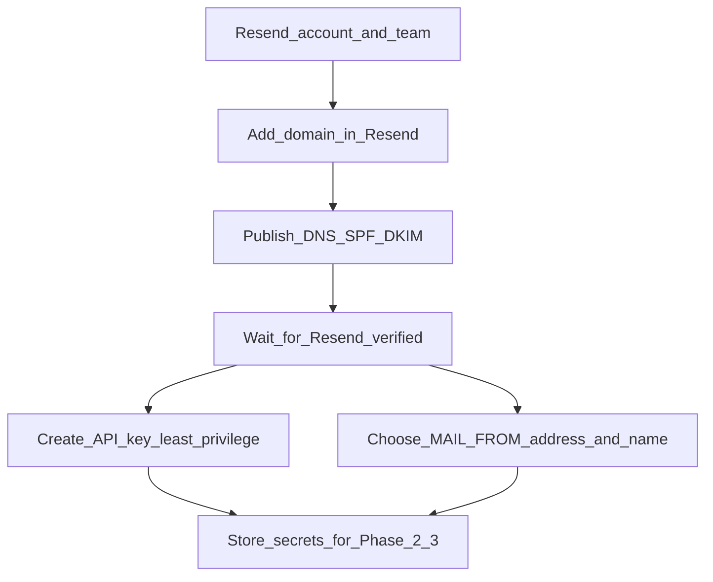
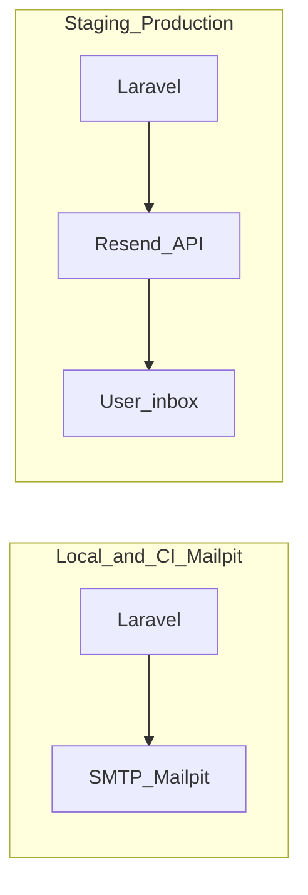

# Email provider migration: Resend

This document describes how Pigpig uses email today and how to use **Resend** in staging/production while keeping **Mailpit** for local development and integration tests.

**Official guide (Laravel):** [Send emails with Laravel (Resend)](https://resend.com/docs/send-with-laravel.md)

---

## Table of contents

- [Implementation checklist (repository vs operator)](#implementation-checklist-repository-vs-operator)
- [Environment matrix](#environment-matrix)
- [Responsibility: who does what](#responsibility-who-does-what)
- [Docker Compose: verification commands (local)](#docker-compose-verification-commands-local)
- [Phase 0 — Prerequisites (Resend account)](#phase-0--prerequisites-resend-account)
- [Phase 1 — PHP dependency](#phase-1--php-dependency)
- [Phase 2 — Environment configuration](#phase-2--environment-configuration)
- [Phase 3 — Deployment (Coolify / CI)](#phase-3--deployment-coolify--ci)
- [Phase 4 — Webhooks (optional, not shipped by default)](#phase-4--webhooks-optional-not-shipped-by-default)
- [Phase 5 — Verification](#phase-5--verification)
- [Resend MCP (Cursor)](#resend-mcp-cursor)
- [Architecture (by environment)](#architecture-by-environment)
- [Decision notes](#decision-notes)

---

## Implementation checklist (repository vs operator)

### In this repository

| Item | Status / action |
|------|-----------------|
| `resend/resend-php` in [`composer.json`](../composer.json) | Declared; run `docker compose exec app composer install` (always use the `app` container for Composer/Artisan/tests locally). |
| Mailer + services | [`config/mail.php`](../config/mail.php) (`resend` transport), [`config/services.php`](../config/services.php) (`RESEND_API_KEY`). |
| Environment template | [`.env.example`](../.env.example) — Mailpit/SMTP for local; commented Resend block for staging/production. |
| Production image | [`Dockerfile`](../Dockerfile) — `composer install` includes production dependencies (Resend client). |
| CI | [`.github/workflows/tests.yml`](../.github/workflows/tests.yml) — uses `.env.example`; do **not** add real `RESEND_API_KEY`. |
| Default PHPUnit mail | [`phpunit.xml`](../phpunit.xml) — `MAIL_MAILER=array` so normal tests do not hit SMTP or Resend. |
| Config regression test | `tests/Unit/MailResendMailerConfigurationTest.php` — asserts Resend mailer is configured (no API calls). |
| Mailpit integration | `docker compose exec app env RUN_MAILPIT_TESTS=1 php artisan test --compact --group=mailpit` — see [Phase 5](#phase-5--verification). |

### Operator / platform (outside Git)

| Item | Where |
|------|--------|
| Resend account, verified domain, DNS (SPF/DKIM), API key | Resend dashboard |
| Staging/production env vars (`MAIL_MAILER`, `RESEND_API_KEY`, `MAIL_FROM_*`) | Coolify or host UI — [COOLIFY.md](./COOLIFY.md) |
| Web + worker | Same mail variables on any app that runs `queue:work` and sends mail |
| Manual smoke (forgot password, etc.) | After deploy |

---

## Environment matrix

| Environment        | Mailer              | Purpose |
|--------------------|---------------------|---------|
| Local / Docker     | `smtp` → Mailpit    | Capture mail in the UI without calling external APIs. |
| PHPUnit (default)  | Fakes / `log` / etc. | Feature tests use `Notification::fake()`; no real delivery. |
| Mailpit integration tests | `smtp` → Mailpit | Run with `RUN_MAILPIT_TESTS=1` and Mailpit running inside the container (see [Docker Compose](#docker-compose-verification-commands-local)). |
| Staging / production | `resend`          | Deliver via Resend API; requires `resend/resend-php` and `RESEND_API_KEY`. |

---

## Responsibility: who does what

| Responsibility | Repository | Operator |
|----------------|------------|----------|
| Declare `resend/resend-php`, Laravel mail config | Yes | — |
| `.env.example` and documented variables | Yes | — |
| CI safe defaults (no live Resend) | Yes | — |
| Verify domain and DNS at Resend | — | Yes |
| Create and store `re_...` API key (never in Git) | — | Yes |
| Set Coolify / server env for web + worker | — | Yes |
| Staging/production smoke tests in a real inbox | — | Yes |

---

## Docker Compose: verification commands (local)

**Policy:** For local development with Docker Compose, run **Composer, Artisan, PHPUnit, and Pint inside the `app` container** (`docker compose exec app …`) so PHP version, extensions, paths, and `.env` match the application. Do not run `php artisan`, `vendor/bin/pint`, or `php artisan test` on the host against this project’s tree unless you intentionally use a matching local PHP install.

The [`composer.json`](../composer.json) script `test:mailpit` is a convenience for host-only workflows; **prefer the container command below** so Mailpit API and SMTP hosts resolve the same way as the rest of the stack.

| Goal | Command |
|------|---------|
| Install dependencies (includes `resend/resend-php`) | `docker compose exec app composer install` |
| Confirm Resend PHP client is installed | `docker compose exec app composer show resend/resend-php` |
| Show effective default mailer (reads `.env`) | `docker compose exec app php artisan config:show mail.default` |
| Format PHP (Pint, dirty files) | `docker compose exec app vendor/bin/pint --dirty --format agent` |
| Full test suite | `docker compose exec app php artisan test --compact` |
| Single test file (example) | `docker compose exec app php artisan test --compact tests/Unit/MailResendMailerConfigurationTest.php` |
| Mailpit integration group (from the container, `MAILPIT_API_URL` should target the Mailpit service, e.g. `http://mailpit:8025` in `.env`; see [`.env.example`](../.env.example)) | `docker compose exec app env RUN_MAILPIT_TESTS=1 php artisan test --compact --group=mailpit` |

---

## Phase 0 — Prerequisites (Resend account)

Phase 0 is **operational only** (Resend dashboard and DNS). No application code changes are required to complete it.

### Recommended order



- **Domain is the critical path:** Without a verified domain, `MAIL_MAILER=resend` will reject or fail sends. DNS propagation can take minutes to hours.
- **API key:** You can create it while DNS propagates, but only **use** it in staging or production after the domain shows as verified and `MAIL_FROM_*` match that domain.

### Operational checklist (definition of done)

| Step | Definition of done |
|------|---------------------|
| Domain | Sending domain shows as verified (or equivalent) in [Resend Domains](https://resend.com/domains). |
| DNS | SPF, DKIM, and any other records Resend shows are published at your authoritative DNS; no typos or wrong zone. |
| From identity | You have chosen the exact `MAIL_FROM_ADDRESS` (for example `noreply@yourdomain.com`) and `MAIL_FROM_NAME` (for example your app name) on the **verified** domain. Do not use placeholder domains in real staging or production. |
| API key | A key exists in the dashboard; the `re_...` value is stored only in a secret store or host environment UI (Coolify, and so on), **never** in Git. |
| Optional | Use **Resend MCP** in Cursor (`list-domains`, `get-domain`, `verify-domain`, `list-api-keys`, `create-api-key`) to double-check status; DNS changes still happen at your DNS provider. |

### Quick actions

- [ ] Create an API key in the [Resend dashboard](https://resend.com/api-keys).
- [ ] Verify your sending domain in [Resend Domains](https://resend.com/domains) (SPF/DKIM).

### Handoff to Phase 2–3

When Phase 0 is done, have ready:

- `RESEND_API_KEY`
- Verified domain plus `MAIL_FROM_ADDRESS` and `MAIL_FROM_NAME`

Apply these on the server as described in [Phase 2 — Environment configuration](#phase-2--environment-configuration) and [COOLIFY.md](./COOLIFY.md).

---

## Phase 1 — PHP dependency

This repository already declares `resend/resend-php` in `composer.json`. After `docker compose exec app composer install`, you can treat the dependency as satisfied and **skip** the `composer require` step unless you are syncing an older checkout.

- [ ] Ensure the Resend PHP client is installed (required for Laravel’s built-in `resend` mail transport):

  ```bash
  docker compose exec app composer require resend/resend-php
  ```

  Skip the command above if `composer.json` already lists `resend/resend-php` and `vendor/` is present; then only run `docker compose exec app composer install` if `vendor/` is missing or out of date.

- [ ] If Composer reports **permission denied** when writing under `vendor/composer/` (common when dependencies were installed as root inside Docker), fix ownership of `vendor` for your user, then run `docker compose exec app composer install` again.

- [ ] **Optional later:** `docker compose exec app composer require resend/resend-laravel` if you need extras from the [Resend Laravel guide](https://resend.com/docs/send-with-laravel.md) (dedicated facade, webhook events, inbound, etc.). The minimal setup is `resend/resend-php` plus `MAIL_MAILER=resend`.

---

## Phase 2 — Environment configuration

**Staging / production**

Set these in your host environment UI (for example Coolify — see [COOLIFY.md](./COOLIFY.md)) on the **web** application. If a **queue worker** sends mail or notifications, set the **same** mail variables on the worker application.

| Variable | Value / notes |
|----------|----------------|
| `MAIL_MAILER` | `resend` |
| `RESEND_API_KEY` | `re_...` (secret only; never commit to Git) |
| `MAIL_FROM_ADDRESS` | Address on your **verified** Resend domain |
| `MAIL_FROM_NAME` | Display name (often matches `APP_NAME`) |

**Local / Docker**

- Keep `MAIL_MAILER=smtp` and Mailpit (`MAIL_HOST=mailpit`, etc.) as in [`.env.example`](../.env.example).
- Leave `RESEND_API_KEY` empty locally unless you intentionally test the Resend API from Docker.
- Never commit real API keys; `.env` must stay out of version control.

**Reference:** [`.env.example`](../.env.example) includes a Resend block and commented production-oriented hints.

**Verify local mailer (optional):** `docker compose exec app php artisan config:show mail.default` should show `smtp` when using Mailpit.

---

## Phase 3 — Deployment (Coolify / CI)

Phase 3 is **operational**: configure your hosting platform (for example Coolify). No application code changes are required if Phases 1–2 are satisfied.

### Before you start (gates)

| Gate | Definition of done |
|------|---------------------|
| Phase 0 | Sending domain verified in Resend; `MAIL_FROM_ADDRESS` / `MAIL_FROM_NAME` use addresses on that domain. |
| Phase 1 (this repository) | `resend/resend-php` is declared in `composer.json`. The production [`Dockerfile`](../Dockerfile) runs `composer install` in the build, so **web** and **worker** images ship with the Resend PHP client. |

Do not point production at Resend until the domain shows as verified; otherwise sends fail or are rejected.

### Staging — web application

On the **staging web** application in Coolify (see [COOLIFY.md](./COOLIFY.md), Step 3), set:

| Variable | Value |
|----------|--------|
| `MAIL_MAILER` | `resend` |
| `RESEND_API_KEY` | `re_...` — store only as a **platform secret**; never commit to Git |
| `MAIL_FROM_ADDRESS` | Address on your **verified** Resend domain |
| `MAIL_FROM_NAME` | Display name (often matches `APP_NAME`) |

- [ ] Variables saved; staging web deploy completes successfully.

### Staging — queue worker (if applicable)

If a separate **worker** application runs `queue:work` and any job sends mail or notifications, it must use the **same** mail-related variables as the web app. Without them, failures appear only in the worker.

- [ ] Worker (staging): `MAIL_MAILER`, `RESEND_API_KEY`, `MAIL_FROM_ADDRESS`, `MAIL_FROM_NAME` match the staging web app.

Details: [COOLIFY.md](./COOLIFY.md), Step 6.

### Staging — smoke test

- [ ] Trigger a flow that sends email (for example Fortify **forgot password** to a mailbox you control).
- [ ] Confirm delivery in the inbox; use [Resend logs](https://resend.com/emails) if you need the provider-side record.

### Production

Repeat the same pattern for **production**: web app first, then worker (if it sends mail). Use production secrets; use separate API keys per environment if your security policy requires it.

- [ ] Production web: `MAIL_MAILER=resend`, `RESEND_API_KEY`, `MAIL_FROM_ADDRESS`, `MAIL_FROM_NAME`.
- [ ] Production worker: same mail variables when queue jobs send email.

### CI (GitHub Actions)

Workflows copy [`.env.example`](../.env.example) (SMTP / Mailpit-oriented). Feature tests rely on `Notification::fake()` and similar patterns; Dusk forces `MAIL_MAILER=array`. **Do not** add `RESEND_API_KEY` to CI for Phase 3 — avoid quota use and flaky external calls. Change workflows only if you observe real SMTP connection issues on the runner against a non-existent `mailpit` host.

### Phase 3 definition of done

- [ ] Staging web sends via Resend; smoke test passed.
- [ ] Staging worker (if any) has mirrored mail configuration when jobs send mail.
- [ ] Production web (and worker, if applicable) configured; optional production smoke.
- [ ] No `re_...` values committed to Git or printed in public build logs.

---

## Phase 4 — Webhooks (optional, not shipped by default)

**This application does not implement Resend webhooks out of the box.** Add this phase only if you adopt `resend/resend-laravel` (or another webhook integration) and need delivery events (`email.delivered`, etc.):

- [ ] Register a public HTTPS webhook URL in Resend.
- [ ] Set `RESEND_WEBHOOK_SECRET` from the dashboard.
- [ ] Exclude `resend/*` from CSRF verification as described in the [Resend Laravel documentation](https://resend.com/docs/send-with-laravel.md).

The Resend MCP can help inspect or create webhooks (`list-webhooks`, `create-webhook`, `get-webhook`).

---

## Phase 5 — Verification

- [ ] **Automated tests:** `docker compose exec app php artisan test --compact` — feature tests such as `tests/Feature/Auth/PasswordResetTest.php` use `Notification::fake()`; no Resend calls. The unit test `tests/Unit/MailResendMailerConfigurationTest.php` only asserts configuration; run it with `docker compose exec app php artisan test --compact tests/Unit/MailResendMailerConfigurationTest.php`.
- [ ] **Mailpit group:** Keep SMTP → Mailpit for `mailpit`-group tests; do not point this group at Resend (avoids real API calls and cost). With the stack up: `docker compose exec app env RUN_MAILPIT_TESTS=1 php artisan test --compact --group=mailpit` (ensure `MAILPIT_API_URL` is reachable from **inside** the container, typically `http://mailpit:8025` in `.env` for Docker Compose).
- [ ] **Manual smoke (staging or production after Phase 2–3):**
  1. Deploy with `MAIL_MAILER=resend` and valid `RESEND_API_KEY` / `MAIL_FROM_*`.
  2. Trigger a flow that sends email (for example Fortify **forgot password** with a mailbox you control).
  3. Confirm delivery in the inbox and, if needed, check [Resend logs](https://resend.com/emails) for the send attempt.

---

## Resend MCP (Cursor)

This project’s Cursor setup can include the **user-resend** MCP server. It talks to **your** Resend account (credentials configured in Cursor), not to the Laravel app.

**Use it for:** operational tasks and debugging — domains, sent messages, logs, webhooks, API keys, templates/broadcasts, or an occasional `send-email` smoke test.

**Do not treat it as:** the application’s sending path. Production and staging mail from Pigpig should go through Laravel (`Mail`, notifications, Fortify) with `MAIL_MAILER=resend` and `RESEND_API_KEY` on the server.

---

## Architecture (by environment)



---

## Decision notes

| Choice | Recommendation |
|--------|----------------|
| Minimal package | `resend/resend-php` + `MAIL_MAILER=resend` (uses existing `config/mail.php` and `config/services.php`) |
| Full Resend Laravel package | `resend/resend-laravel` if you need webhooks and other features from their guide |
| Local development | Keep Mailpit + SMTP |
| Default mailer in `config/mail.php` | `env('MAIL_MAILER', 'log')`; production overrides via `.env` — changing the fallback is optional |
