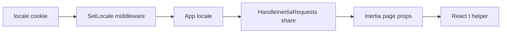

# Frontend translation — phased roadmap

This document is a **planning and tracking guide only**. Implement translation work in **separate PRs, one phase at a time**, and check off items below as each phase ships. That keeps reviews small and avoids translating the entire UI in a single change.

---

## Purpose

- Define **ordered phases** for replacing hardcoded copy in the Inertia React app with locale-aware strings.
- List **which files** belong to each phase.
- Record **recommended libraries / architecture** (no code here — apply when implementing).
- Specify **how to validate** each phase and **which tests** to run.

---

## Current stack snapshot

| Area | Status |
|------|--------|
| **Locale** | `locale` cookie is read in [`app/Http/Middleware/SetLocale.php`](../app/Http/Middleware/SetLocale.php); supported locales are defined in [`config/locales.php`](../config/locales.php). |
| **Inertia** | [`app/Http/Middleware/HandleInertiaRequests.php`](../app/Http/Middleware/HandleInertiaRequests.php) shares `locale` on every page. |
| **Lang files** | [`lang/en.json`](../lang/en.json) and [`lang/pt_BR.json`](../lang/pt_BR.json) exist but only contain a few Fortify-related entries (sentence-as-key style). |
| **React** | No shared `t()` / i18n helper; many strings are hardcoded. Some screens mix languages (e.g. Portuguese labels with English placeholders). |
| **Backend copy** | Some flash messages and errors already use `__()` (e.g. [`app/Services/GroupJoinRequestService.php`](../app/Services/GroupJoinRequestService.php), [`app/Http/Controllers/GroupJoinRequestController.php`](../app/Http/Controllers/GroupJoinRequestController.php)). Those strings must exist in both locale files for users to see the correct language. |
| **Locale switcher** | [`resources/js/components/locale-switcher.tsx`](../resources/js/components/locale-switcher.tsx) posts to [`routes/web.php`](../routes/web.php) `locale.update`. |
| **Existing tests** | [`tests/Feature/LocaleUpdateTest.php`](../tests/Feature/LocaleUpdateTest.php) covers cookie, validation, and shared `locale` on the home page. |

---

## Recommended approach (for future implementation)

### Source of truth

| Piece | Recommendation |
|--------|----------------|
| **Translation files** | Keep using Laravel `lang/{locale}.json`. Prefer **namespaced keys** (e.g. `auth.login.title`) instead of full English sentences as keys — easier to grep and stable when copy changes. |
| **Wire to React** | Share a `translations` (or `messages`) object from `HandleInertiaRequests::share()`: load the active locale JSON (optionally merge `fallback_locale` for missing keys). A small `t(key, replaces?)` helper plus `usePage().props` is enough — **no extra npm package required**. |
| **Optional: `react-i18next`** | Consider only if you need ICU plurals, lazy-loaded namespaces, or client-only locale changes without a full visit. It often duplicates strings unless you generate JSON from Laravel or sync tooling. **Default: avoid new dependencies** until there is a clear need (aligns with not adding deps without approval). |

### Data flow (reference)



---

## Global validation (repeat after every phase)

Use this checklist whenever a phase is merged.

- [ ] **Manual**: Set locale to **EN** via the locale switcher; open every route touched in that phase; repeat for **pt_BR**. No mixed-language leftovers in scope.
- [ ] **Automated**: `php artisan test --compact tests/Feature/LocaleUpdateTest.php` (and any new locale/translation tests).
- [ ] **Full suite** (before larger merges): `php artisan test --compact`.
- [ ] **Typecheck** (when TS/shared props change): `npm run types:check`.
- [ ] **Lint/format** (when JS/TS changes): `npm run lint:check` and `npm run format:check`.

**Docker Compose** (if you use it): prefix PHP commands with `docker compose exec app` (see [`AGENTS.md`](../AGENTS.md)).

---

## Phase 0 — Infrastructure

**Goal (future PR):** Any page can resolve UI strings from server-provided data (e.g. `t('some.key')`), with TypeScript aware of shared props.

### File checklist

- [ ] [`app/Http/Middleware/HandleInertiaRequests.php`](../app/Http/Middleware/HandleInertiaRequests.php) — share `translations` (and merge strategy with fallback locale, if desired).
- [ ] New JS module — e.g. `resources/js/lib/i18n.ts` or `resources/js/hooks/use-translations.ts` — dot-key lookup, optional replacements.
- [ ] [`resources/js/types/global.d.ts`](../resources/js/types/global.d.ts) — extend shared Inertia props with `translations`.
- [ ] Tests — extend [`tests/Feature/LocaleUpdateTest.php`](../tests/Feature/LocaleUpdateTest.php) and/or add a feature test asserting Inertia shared `translations` contains a known key for `en` and `pt_BR` when the `locale` cookie is set.

### Definition of done

- [ ] Visiting a page with `locale=en` and `locale=pt_BR` yields the correct shared translation map (or merged fallback behavior you documented).
- [ ] `npm run types:check` passes.
- [ ] New/updated tests pass in isolation and with the full suite (per team rule).

### Suggested tests

```bash
php artisan test --compact tests/Feature/LocaleUpdateTest.php
# plus any new test file, e.g.:
# php artisan test --compact tests/Feature/TranslationPropsTest.php
php artisan test --compact
```

---

## Phase 1 — Authentication

**Scope:** Fortify views and shared auth chrome.

### File checklist

**Auth pages**

- [x] [`resources/js/pages/auth/login.tsx`](../resources/js/pages/auth/login.tsx)
- [x] [`resources/js/pages/auth/register.tsx`](../resources/js/pages/auth/register.tsx)
- [x] [`resources/js/pages/auth/forgot-password.tsx`](../resources/js/pages/auth/forgot-password.tsx)
- [x] [`resources/js/pages/auth/reset-password.tsx`](../resources/js/pages/auth/reset-password.tsx)
- [x] [`resources/js/pages/auth/verify-email.tsx`](../resources/js/pages/auth/verify-email.tsx)
- [x] [`resources/js/pages/auth/confirm-password.tsx`](../resources/js/pages/auth/confirm-password.tsx)
- [x] [`resources/js/pages/auth/two-factor-challenge.tsx`](../resources/js/pages/auth/two-factor-challenge.tsx)

**Auth layouts**

- [x] [`resources/js/layouts/auth-layout.tsx`](../resources/js/layouts/auth-layout.tsx)
- [x] [`resources/js/layouts/auth/auth-card-layout.tsx`](../resources/js/layouts/auth/auth-card-layout.tsx)
- [x] [`resources/js/layouts/auth/auth-split-layout.tsx`](../resources/js/layouts/auth/auth-split-layout.tsx)
- [x] [`resources/js/layouts/auth/auth-simple-layout.tsx`](../resources/js/layouts/auth/auth-simple-layout.tsx) — no user-facing copy (titles come from parent)

**Related components**

- [x] [`resources/js/components/delete-user.tsx`](../resources/js/components/delete-user.tsx)
- [x] [`resources/js/components/email-verification-banner.tsx`](../resources/js/components/email-verification-banner.tsx)
- [x] [`resources/js/components/two-factor-setup-modal.tsx`](../resources/js/components/two-factor-setup-modal.tsx)
- [x] [`resources/js/components/two-factor-recovery-codes.tsx`](../resources/js/components/two-factor-recovery-codes.tsx)

**Backend / lang**

- [x] Keep [`lang/en.json`](../lang/en.json) and [`lang/pt_BR.json`](../lang/pt_BR.json) in sync for Fortify-related strings and any new keys introduced when moving copy out of TSX.

### Definition of done

- [x] No user-visible hardcoded strings remain in the files above (labels, buttons, headings, `Head` titles, validation-related hints where applicable).
- [x] Keys exist in both `en` and `pt_BR` JSON (or documented fallback).

### Validation

- [ ] Use [`resources/js/components/locale-switcher.tsx`](../resources/js/components/locale-switcher.tsx) on each auth screen (where rendered); verify copy in EN and pt_BR.
- [ ] Spot-check every Fortify route: login, register, forgot/reset password, verify email, confirm password, 2FA challenge.

### Suggested tests

- [x] Inertia assertions on 1–2 representative pages (e.g. login + register) with `locale` cookie set to `en` and `pt_BR` — see [`tests/Feature/Auth/AuthTranslationPropsTest.php`](../tests/Feature/Auth/AuthTranslationPropsTest.php).
- [x] Run: `php artisan test --compact --filter=…` for those tests, then `php artisan test --compact`.

---

## Phase 2 — App shell (navigation and chrome)

**Scope:** Layout and navigation around authenticated pages.

### File checklist

**Sidebar / nav**

- [x] [`resources/js/components/app-sidebar.tsx`](../resources/js/components/app-sidebar.tsx)
- [x] [`resources/js/components/nav-main.tsx`](../resources/js/components/nav-main.tsx)
- [x] [`resources/js/components/nav-footer.tsx`](../resources/js/components/nav-footer.tsx) — keys only (`href`-stable list items)
- [x] [`resources/js/components/nav-user.tsx`](../resources/js/components/nav-user.tsx) — no user-facing copy
- [x] [`resources/js/components/user-menu-content.tsx`](../resources/js/components/user-menu-content.tsx)

**Headers / shell**

- [x] [`resources/js/components/app-header.tsx`](../resources/js/components/app-header.tsx)
- [x] [`resources/js/components/app-sidebar-header.tsx`](../resources/js/components/app-sidebar-header.tsx) — no copy (locale switcher text in Phase 6)
- [x] [`resources/js/components/app-shell.tsx`](../resources/js/components/app-shell.tsx) — no copy
- [x] [`resources/js/components/app-content.tsx`](../resources/js/components/app-content.tsx) — no copy
- [x] [`resources/js/components/breadcrumbs.tsx`](../resources/js/components/breadcrumbs.tsx)

**Layouts**

- [x] [`resources/js/layouts/app/app-sidebar-layout.tsx`](../resources/js/layouts/app/app-sidebar-layout.tsx) — no copy changes
- [x] [`resources/js/layouts/app/app-header-layout.tsx`](../resources/js/layouts/app/app-header-layout.tsx) — no copy changes

**Product decision (record your choice)**

- [x] External link titles (e.g. “Repository”, “Documentation” in the sidebar footer): **translate** / **keep English** — decision: **translate** (keys `app.shell.footer.*`).

### Definition of done

- [x] Nav labels, section labels (e.g. sidebar group titles), and shell UI strings in scope use translation keys.
- [x] Breadcrumbs and header chrome consistent with locale.

### Validation

- [ ] Logged-in smoke test: sidebar, user menu, breadcrumbs, main header.

### Suggested tests

- [x] [`tests/Feature/AppShellTranslationPropsTest.php`](../tests/Feature/AppShellTranslationPropsTest.php) — dashboard Inertia `translations` for `en` / `pt_BR`.

---

## Phase 3 — Settings

**Scope:** Settings area and related UI.

### File checklist

- [ ] [`resources/js/layouts/settings/layout.tsx`](../resources/js/layouts/settings/layout.tsx)
- [ ] [`resources/js/pages/settings/profile.tsx`](../resources/js/pages/settings/profile.tsx)
- [ ] [`resources/js/pages/settings/security.tsx`](../resources/js/pages/settings/security.tsx)
- [ ] [`resources/js/pages/settings/appearance.tsx`](../resources/js/pages/settings/appearance.tsx)
- [ ] [`resources/js/components/appearance-tabs.tsx`](../resources/js/components/appearance-tabs.tsx) (if it exposes user-visible copy)

### Definition of done

- [ ] All settings tabs and navigation labels translated; `Head` titles localized.

### Validation

- [ ] Open each settings route with EN and pt_BR; verify tab names, headings, and actions.

### Suggested tests

- [ ] Optional: Inertia visit to settings routes with locale cookie and assert a stable translated fragment (only if not brittle).

---

## Phase 4 — Authenticated app pages (dashboard and groups)

**Scope:** Main product screens after login.

### File checklist

- [ ] [`resources/js/pages/dashboard.tsx`](../resources/js/pages/dashboard.tsx)
- [ ] [`resources/js/pages/my-groups/index.tsx`](../resources/js/pages/my-groups/index.tsx)
- [ ] [`resources/js/pages/groups/create.tsx`](../resources/js/pages/groups/create.tsx)
- [ ] [`resources/js/components/drp-by-polo-select.tsx`](../resources/js/components/drp-by-polo-select.tsx)
- [ ] [`resources/js/components/groups-public-shell.tsx`](../resources/js/components/groups-public-shell.tsx) (if used in authenticated flows)

**Backend / lang alignment**

- [ ] Every user-visible string passed through `__()` in [`app/Services/GroupJoinRequestService.php`](../app/Services/GroupJoinRequestService.php) has entries in `lang/en.json` and `lang/pt_BR.json`.
- [ ] Same for [`app/Http/Controllers/GroupJoinRequestController.php`](../app/Http/Controllers/GroupJoinRequestController.php) flash messages.
- [ ] Form request validation messages users see — ensure they are translated for both locales (PHP lang files or JSON, per project convention).

### Definition of done

- [ ] Dashboard and group flows show no hardcoded mixed-language UI in scope.
- [ ] Join-request success/error/flash strings respect the active locale.

### Validation

- [ ] Create group, request to join, accept/decline (as applicable) with EN and pt_BR.
- [ ] Confirm flash and validation errors appear in the correct language.

### Suggested tests

- [ ] Feature tests posting with `locale` cookie; assert session flash or JSON error text where strings are stable.

---

## Phase 5 — Public marketing and public groups

**Scope:** Landing and unauthenticated group browsing.

### File checklist

- [ ] [`resources/js/pages/welcome.tsx`](../resources/js/pages/welcome.tsx)
- [ ] [`resources/js/components/landing/landing-nav.tsx`](../resources/js/components/landing/landing-nav.tsx)
- [ ] [`resources/js/components/landing/landing-hero.tsx`](../resources/js/components/landing/landing-hero.tsx)
- [ ] [`resources/js/components/landing/landing-problem.tsx`](../resources/js/components/landing/landing-problem.tsx)
- [ ] [`resources/js/components/landing/landing-how-it-works.tsx`](../resources/js/components/landing/landing-how-it-works.tsx)
- [ ] [`resources/js/components/landing/landing-benefits.tsx`](../resources/js/components/landing/landing-benefits.tsx)
- [ ] [`resources/js/components/landing/landing-about.tsx`](../resources/js/components/landing/landing-about.tsx)
- [ ] [`resources/js/components/landing/landing-cta.tsx`](../resources/js/components/landing/landing-cta.tsx)
- [ ] [`resources/js/components/landing/landing-footer.tsx`](../resources/js/components/landing/landing-footer.tsx)
- [ ] [`resources/js/pages/groups/index.tsx`](../resources/js/pages/groups/index.tsx)
- [ ] [`resources/js/pages/groups/show.tsx`](../resources/js/pages/groups/show.tsx)
- [ ] [`app/Http/Controllers/PublicGroupController.php`](../app/Http/Controllers/PublicGroupController.php) — audit props for server-built copy; add lang entries if needed.

### Definition of done

- [ ] Home and public group pages read correctly in both locales; CTAs and nav consistent.

### Validation

- [ ] `/` and `/groups` (and a sample `/groups/{id}`) with EN and pt_BR cookies.

### Suggested tests

- [ ] Extend [`tests/Feature/LocaleUpdateTest.php`](../tests/Feature/LocaleUpdateTest.php) patterns or add tests that assert Inertia props / DOM-safe strings where practical.

---

## Phase 6 — Global polish

**Scope:** Cross-cutting items; do **after** Phases 1–5 are stable.

### File checklist

- [ ] [`resources/js/components/locale-switcher.tsx`](../resources/js/components/locale-switcher.tsx) — `aria-label` / `role="group"` label via translation keys.
- [ ] [`resources/js/components/alert-error.tsx`](../resources/js/components/alert-error.tsx) — if it contains default user-facing text.
- [ ] [`resources/js/components/input-error.tsx`](../resources/js/components/input-error.tsx) — if it contains default user-facing text.
- [ ] [`resources/js/app.tsx`](../resources/js/app.tsx) — document title pattern: align `<Head title>` (and global title callback) with translated strings or server-provided titles.

**Optional**

- [ ] [`resources/views/app.blade.php`](../resources/views/app.blade.php) — already sets `html` `lang` from `app()->getLocale()`; extend only if you add more translated meta.

### Definition of done

- [ ] Accessibility strings for the locale control are localized.
- [ ] Page titles behave consistently across locales.

### Validation

- [ ] Screen reader or devtools audit for the locale switcher labels in both languages.
- [ ] Tab title spot-check on representative pages.

---

## Out of scope (unless explicitly expanded)

- **UI primitives** under `resources/js/components/ui/` — translate only if a component ships default user-visible copy (most are structural).
- **Third-party link titles** — covered by the product decision in Phase 2.

---

## Revision history

| Date | Note |
|------|------|
| 2026-04-04 | Phase 1 (auth) implemented: namespaced `auth.*` keys in `lang/en.json` / `lang/pt_BR.json`, `useTranslations()` on auth pages and related components, `AuthTranslationPropsTest`. |
| 2026-04-04 | Phase 2 (app shell): `app.shell.*` keys, sidebar/header/user menu/breadcrumbs via `titleKey`, `AppShellTranslationPropsTest`. |
| (add rows as this roadmap is updated) | |
