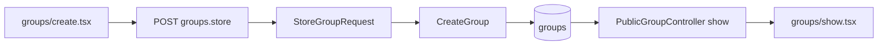

# Phased plan: new fields on group creation (`description` and extensible pattern)

## Current context

- **Persistence:** `database/migrations/2026_04_03_171209_create_groups_table.php` defines `title` and `external_communication_link` (no `description`).
- **Model:** `app/Models/Group.php` — `#[Fillable([...])]` only includes those columns.
- **Creation:** `app/Actions/CreateGroup.php` accepts `title` and optional link; `app/Http/Controllers/GroupController.php` `store` uses `StoreGroupRequest`.
- **Form:** `resources/js/pages/groups/create.tsx` — title + URL; Wayfinder `groupsStore.form()`.
- **Display:** `PublicGroupController` sends `id`, `title`, `drp` on the public index and show payloads; `groups/show.tsx` types `group` without `description`. There is no group update route.

## Product decisions (implemented)

- **`description`:** optional, nullable `text` column; validation `nullable|string|max:5000`; textarea `maxLength={5000}` on the create form.
- **Public index listing:** `description` is **not** included in the paginated payload (smaller response); users see the full description on the group show page only.
- **My DRP groups (`my-groups/index`):** list stays title-only; no `description` in `GroupController::myDrpIndex`.

## Phase 1 — Database and model

- Migration adds `description` as nullable `text` on `groups`.
- `Group` `#[Fillable]` includes `description`.
- `GroupFactory` sets optional fake paragraph or `null` by default.

## Phase 2 — Validation, action, controller

- `StoreGroupRequest`: rules + `attributes()` for `description`.
- `CreateGroup::execute`: optional `?string $description = null` after the external link argument; passed into `Group::create([...])`.
- `GroupController::store`: passes `$validated['description'] ?? null`.

## Phase 3 — Create form (Inertia + i18n)

- `resources/js/pages/groups/create.tsx`: textarea `name="description"`, `id="groups-create-description"`, `InputError` for `description`.
- `lang/en.json` and `lang/pt_BR.json`: `groups.create.label.description`, `placeholder`, `attribute.description`.

## Phase 4 — Expose `description` in Inertia

- `PublicGroupController::show`: add `description` to the `group` array (nullable string).
- `groups/show.tsx`: extend types and render description below the title when present.
- Public index and my-groups payloads unchanged for `description`.

## Phase 5 — Tests and formatting

- `AuthenticatedGroupCreateTest`: POST with `description`, database assertion; optional max-length validation test.
- `GroupPersistenceTest`: action/factory assertions for `description` where relevant.
- `PublicGroupDiscoveryTest`: assert `group.description` on show when set.
- Run affected tests, then full suite; run Pint on dirty PHP files.

## Phase 6 (optional) — Pattern for more fields

Repeat per field: migration → `fillable` → factory → `StoreGroupRequest` → `CreateGroup` + controller → create form + translations → Inertia props + React types → tests. Member-only or sensitive fields need explicit checks in `PublicGroupController::show` (same idea as member phone visibility).

## Data flow

